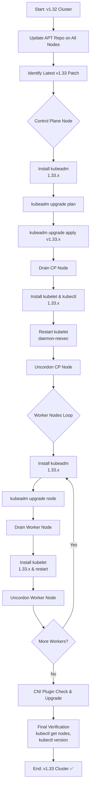

## Deep Upgrade Guide: Kubernetes v1.32 → v1.33 with kubeadm

This guide provides a step-by-step process for upgrading a Kubernetes cluster from v1.32 to v1.33 using `kubeadm`, including in-depth explanations and a Mermaid flowchart to visualize the workflow.

---

### 1. Preparation & Context

**Why Upgrade?**
- Access the latest security patches, bug fixes, and performance improvements.
- Ensure compatibility with new Custom Resource Definitions (CRDs), API deprecations, and Container Network Interface (CNI) plugin versions.

**Cluster Topology Assumptions**
- **Control Plane Nodes (CP):** Host the API server, scheduler, and controller-manager.
- **Worker Nodes (WN):** Run workloads.
- This guide assumes a single control plane node. For High Availability (HA) clusters with multiple CP nodes, repeat relevant steps for each CP node.
- Nodes run a Debian-based OS (e.g., Ubuntu) with `apt` for package management.

**Key Binary Roles**
- **kubeadm:** Orchestrates the upgrade process.
- **kubelet:** Node agent, must be manually upgraded on each node.
- **kubectl:** Client CLI, optional on worker nodes but recommended for consistency.

---

### 2. Update Package Repository (All Nodes)

Update the package repository on all control plane and worker nodes to point to the Kubernetes v1.33 repository.

```bash
# Install transport tools and create keyrings directory
sudo apt-get install -y apt-transport-https ca-certificates curl
sudo mkdir -p /etc/apt/keyrings

# Fetch and dearmor the signing key
curl -fsSL https://pkgs.k8s.io/core:/stable:/v1.33/deb/Release.key \
  | sudo gpg --dearmor -o /etc/apt/keyrings/kubernetes-apt-keyring.gpg

# Add the v1.33 repository
echo "deb [signed-by=/etc/apt/keyrings/kubernetes-apt-keyring.gpg] \
  https://pkgs.k8s.io/core:/stable:/v1.33/deb/ /" \
  | sudo tee /etc/apt/sources.list.d/kubernetes.list

# Refresh package index
sudo apt-get update
```

**Deep Explanation**
- **Transport & Certificates:** `apt-transport-https` and `ca-certificates` enable secure HTTPS communication for APT.
- **Key Management:** The GPG keyring ensures package integrity and authenticity.
- **Repository Path:** Kubernetes maintains separate repositories for each minor version (e.g., `core:/stable:/v1.33`).
- **All Nodes:** Consistent repository configuration prevents version mismatches across control plane and worker nodes.

---

### 3. Pinpoint the Exact Patch Release

Identify the latest patch release for Kubernetes v1.33 to ensure you’re using the most stable and secure version.

```bash
apt-cache madison kubeadm | grep 1.33
```

**Goal:** Select the highest patch version (e.g., `1.33.1-1.1`).

**Why:** Kubernetes follows Semantic Versioning (SemVer). Patch releases (e.g., 1.33.0, 1.33.1) include critical bug fixes and security patches. Always choose the latest patch for stability.

---

### 4. Control Plane Upgrade

Upgrade the control plane node(s) first, as they manage the cluster’s state.

#### 4.1 Upgrade `kubeadm` & Run Pre-flight Checks

```bash
# Install the specific kubeadm version
sudo apt-get install -y kubeadm=1.33.1-1.1

# Verify kubeadm version
kubeadm version

# Run pre-flight checks
sudo kubeadm upgrade plan
```

**What `kubeadm upgrade plan` Does:**
- Simulates the upgrade process.
- Lists control plane components (API Server, Controller Manager, Scheduler, etcd clients) and checks for compatibility issues.
- Highlights any deprecated APIs or configuration changes.

#### 4.2 Apply the Control Plane Upgrade

```bash
sudo kubeadm upgrade apply v1.33.1
```

**What Happens:**
- Updates control plane component manifests (e.g., API Server, Controller Manager).
- Rolls out new pod images one by one to ensure zero downtime.
- Updates etcd if necessary (check release notes for v1.33-specific changes).

#### 4.3 Drain the Control Plane Node

```bash
kubectl drain <cp-node> --ignore-daemonsets
```

**Purpose:** Evicts non-DaemonSet pods from the control plane node to safely restart `kubelet` without disrupting critical add-ons (e.g., CoreDNS, CNI plugins).

#### 4.4 Upgrade `kubelet` & `kubectl`

```bash
# Install matching kubelet and kubectl versions
sudo apt-get install -y kubelet=1.33.1-1.1 kubectl=1.33.1-1.1

# Reload systemd and restart kubelet
sudo systemctl daemon-reexec
sudo systemctl restart kubelet
```

**Explanation:**
- **daemon-reexec:** Reloads systemd unit files to recognize new binaries.
- **restart kubelet:** Ensures the new `kubelet` version is active and reconciles with the upgraded control plane.

#### 4.5 Uncordon the Control Plane Node

```bash
kubectl uncordon <cp-node>
kubectl get nodes
```

**Verification:** The control plane node should transition from `SchedulingDisabled` to `Ready` with version `v1.33.1`.

---

### 5. Worker Node Upgrade (Repeat per Worker Node)

Upgrade each worker node sequentially to minimize disruption.

1. **Install New `kubeadm`**

```bash
sudo apt-get install -y kubeadm=1.33.1-1.1
```

2. **Upgrade Node Object**

```bash
sudo kubeadm upgrade node
```

**Purpose:** Updates the node’s configuration to align with the v1.33 control plane.

3. **Drain the Node**

```bash
kubectl drain <worker-node> --ignore-daemonsets
```

**Purpose:** Evicts non-DaemonSet pods to prepare for `kubelet` restart.

4. **Upgrade `kubelet`**

```bash
sudo apt-get install -y kubelet=1.33.1-1.1
sudo systemctl daemon-reexec && sudo systemctl restart kubelet
```

5. **Uncordon & Verify**

```bash
kubectl uncordon <worker-node>
kubectl get nodes
```

**Verification:** The worker node should show as `Ready` with version `v1.33.1`.

---

### 6. CNI Plugin & HA Considerations

**CNI Plugin**
- Check your CNI plugin’s GitHub or release page for v1.33 compatibility (e.g., Calico, Flannel, Weave).
- Upgrade the CNI plugin (if needed) before or immediately after the control plane upgrade to avoid networking issues.
- Apply updated manifests as per vendor instructions.

**High Availability (HA) Control Plane**
- For HA clusters, repeat steps 4.1–4.5 for each additional control plane node, replacing `kubeadm upgrade apply` with `kubeadm upgrade node`.
- Ensure all control plane nodes are upgraded before proceeding to worker nodes.

---

### 7. Final Verification

Run the following to confirm the cluster is fully upgraded and healthy:

```bash
# Verify all nodes are running v1.33.1 and Ready
kubectl get nodes

# Confirm kubeadm version
kubeadm version

# Check client and server versions
kubectl version --short

# Verify system pods
kubectl get pods --all-namespaces
```

**What to Check:**
- All nodes report `v1.33.1` and `Ready`.
- System pods (CoreDNS, kube-proxy, CNI) are in `Running` state.
- Run smoke tests on workloads to ensure functionality.

---

### 8. Troubleshooting & Tips

| **Symptom**                     | **Possible Cause**                     | **Remedy**                                                                 |
|---------------------------------|----------------------------------------|---------------------------------------------------------------------------|
| Node stays `SchedulingDisabled`  | Missed `kubectl uncordon`              | Run `kubectl uncordon <node>`                                             |
| `kubeadm upgrade plan` fails    | Mixed repo versions, expired key       | Verify `/etc/apt/sources.list.d/` and keyring; re-run repo setup steps    |
| Networking pods crash-looping   | CNI version mismatch                   | Upgrade CNI plugin per vendor documentation                               |
| `kubelet` won’t start           | Systemd unit mismatch, cached binary    | Run `systemctl daemon-reload` and `systemctl restart kubelet`             |

**Tips:**
- Always back up etcd before upgrading.
- Test upgrades in a staging environment first.
- Monitor release notes for v1.33-specific changes (e.g., API deprecations).

---

### Mermaid Flowchart



**Flowchart Explanation**
- **Linear Phases:** Preparation → Control Plane Upgrade → Worker Node Upgrade → CNI Check → Verification.
- **Loops:** Worker nodes are upgraded sequentially.
- **Decision Nodes:** Handle HA vs. single control plane and worker node iteration.

---

### Additional Notes
- **Customization:** Adjust node names, patch versions, or CNI configurations as needed for your environment.
- **Firewall Rules:** Ensure your organization’s firewall allows access to the Kubernetes package repository.
- **Export Options:** If you need this guide in another format (e.g., PDF), let me know, and I can assist with generating it.
- **Kubernetes Release Notes:** Review the [Kubernetes v1.33 changelog](https://github.com/kubernetes/kubernetes/blob/master/CHANGELOG/CHANGELOG-1.33.md) for specific changes or deprecations.

Let me know if you need further clarification, additional steps, or help with specific scenarios (e.g., HA clusters, specific CNI plugins, or troubleshooting)!
