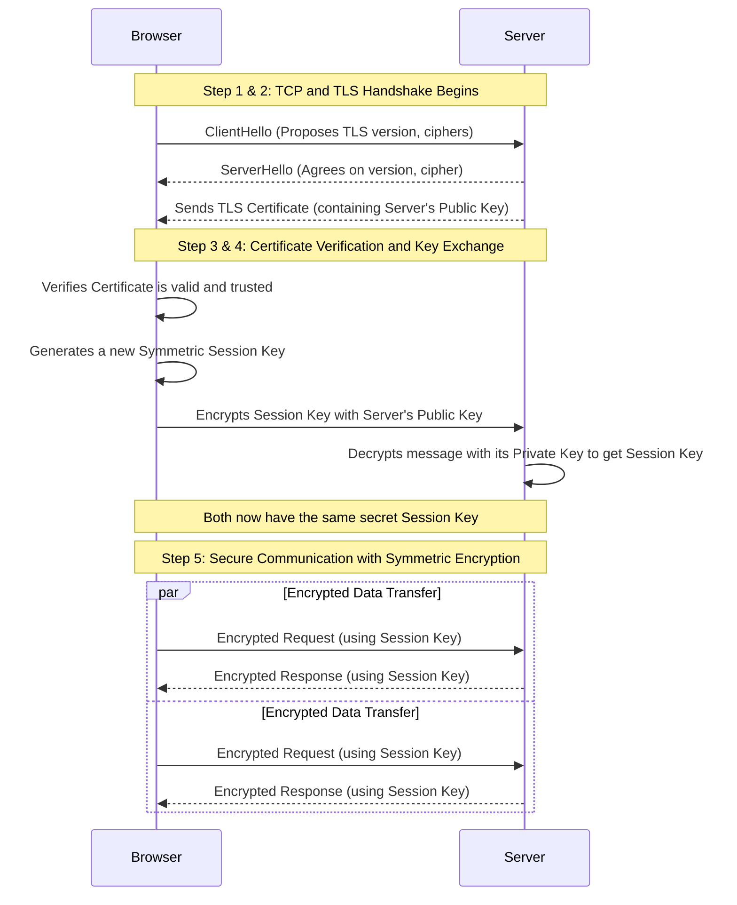

### **Comprehensive Notes on Encryption: Symmetric, Asymmetric, and TLS/SSL**

These notes provide a deep dive into the principles of symmetric and asymmetric encryption, explaining how they are combined in the TLS/SSL protocol to ensure secure communication over the internet.

---

### **1. Deep Dive into Symmetric Encryption**

Symmetric encryption is a method of cryptography that uses a single, shared secret key for both the encryption and decryption of data.

*   **Core Concept:** Imagine a physical lockbox that can be opened and closed with the same key. If two individuals, Alice and Bob, want to exchange secret messages, they must both possess an identical copy of this key.
*   **Process:**
    1.  Alice composes a message (plaintext).
    2.  She uses the shared secret key to encrypt the message, transforming it into an unreadable format (ciphertext).
    3.  Bob receives the ciphertext and uses the same shared key to decrypt it, restoring the original plaintext.
*   **Strengths:**
    *   **Speed and Efficiency:** Symmetric algorithms are computationally very fast, requiring minimal processing power. This makes them ideal for encrypting large volumes of data, such as streaming video or large file transfers.
    *   **Simplicity:** The underlying algorithms, like the widely trusted **Advanced Encryption Standard (AES)**, are straightforward to implement.
*   **Weaknesses:**
    *   **The Key Distribution Problem:** The primary challenge is securely sharing the secret key between the communicating parties *before* any encrypted communication can begin. If an attacker intercepts the key during this initial exchange, all subsequent encrypted data is compromised.

---

### **2. Deep Dive into Asymmetric Encryption**

Asymmetric encryption, also known as public-key cryptography, uses a pair of mathematically related keys: a public key and a private key.

*   **Core Concept:** This system is analogous to a mailbox with a public mail slot and a private, locked door. Anyone can drop a letter into the mail slot (encrypt with the public key), but only the owner with the unique key can open the door to read the letters (decrypt with the private key).
*   **Process:**
    1.  Bob generates a key pair: a **public key**, which he can share freely with anyone, and a **private key**, which he must keep secret.
    2.  Alice obtains Bob's public key and uses it to encrypt her message.
    3.  Once encrypted, the message can *only* be decrypted by Bob's corresponding private key. Even Alice, the original sender, cannot decrypt it with the public key.
*   **Strengths:**
    *   **Secure Key Exchange:** It elegantly solves the key distribution problem, as the private key is never shared.
    *   **Enables Digital Signatures:** It provides a mechanism for **authentication** and **non-repudiation**. A message signed with a private key can be verified by anyone with the public key, proving the sender's identity and ensuring they cannot deny sending it.
*   **Weaknesses:**
    *   **Slow Performance:** Asymmetric encryption is computationally intensive and significantly slower than symmetric encryption, making it impractical for encrypting large amounts of data.

---

### **3. The Hybrid Model: How TLS/SSL Combines Both**

The TLS (Transport Layer Security) protocol, the successor to SSL, leverages the strengths of both encryption types to create a communication channel that is both secure and efficient. This is the technology that powers `https://` connections.

The process unfolds in a sequence of steps known as the **TLS Handshake**.

*   **Step 1: Initial Connection (TCP Handshake)**
    *   The client (your browser) and the server establish a basic network connection. This is a prerequisite for any communication.

*   **Step 2: TLS Handshake Initiation**
    *   **ClientHello:** The browser sends a message to the server, announcing its capabilities (e.g., "I can use TLS 1.3 and these specific encryption algorithms").
    *   **ServerHello:** The server responds, agreeing on the protocol and algorithm to use. It then sends its **TLS certificate**. This certificate contains its public key, domain name, and a digital signature from a trusted **Certificate Authority (CA)**.

*   **Step 3: Certificate Verification**
    *   The browser verifies the server's certificate by checking it against its built-in list of trusted CAs. This step confirms that the server is who it claims to be.

*   **Step 4: Secure Key Exchange (The Hybrid Magic)**
    *   This is where asymmetric encryption is used to solve the key distribution problem.
    1.  The browser generates a new, temporary **symmetric key** (often called a "session key").
    2.  It uses the server's **public key** (from the certificate) to encrypt this session key.
    3.  The encrypted session key is sent to the server.
    4.  The server uses its **private key** to decrypt the message and retrieve the symmetric session key.
    *   At the end of this step, both the client and server now share the same secret session key, which was exchanged securely without ever being transmitted in plaintext.

*   **Step 5: Secure Data Transfer**
    *   With the shared session key established, the handshake is complete.
    *   All subsequent communication between the browser and the server (e.g., sending passwords, credit card numbers, or browsing activity) is encrypted and decrypted using the fast and efficient **symmetric session key**.

---

### **4. Diagram: TLS Handshake and Data Flow**

This diagram illustrates how asymmetric encryption is used during the handshake to establish a secure channel, after which symmetric encryption takes over for the actual data transfer.

### **5. Summary: Why This Hybrid Approach is Essential**

The combination of encryption methods allows TLS to achieve the best of both worlds:

| Encryption Type | Purpose in TLS | Key Advantage |
| :--- | :--- | :--- |
| **Asymmetric** | Used only during the initial handshake. | **Security:** Enables the authentication of the server and the secure exchange of the session key. |
| **Symmetric** | Used for all data transfer after the handshake. | **Performance:** Provides fast and efficient encryption for the bulk of the communication. |

This two-pronged strategy ensures that modern internet connections are both robustly secure and highly performant.
