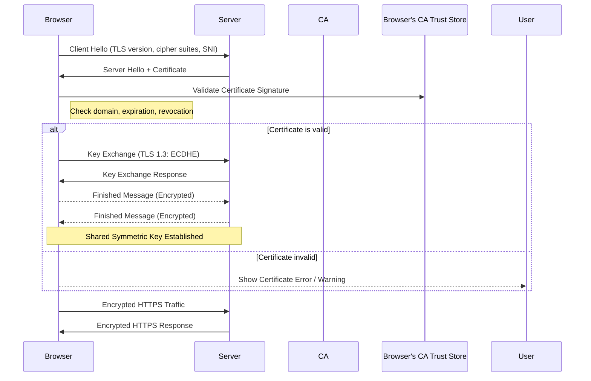

# 📚 TLS, HTTPS, Certificates & PKI – **Simplified Notes**

---

## 🔐 1. The Phishing Attack Setup

* A **hacker creates a fake website** that **looks exactly** like your bank’s website.
* He sets up **his own web server** and generates a **self-signed certificate** with his **own key pair**.
* He **tricks your DNS/network** so your browser **lands on his fake server** when you type the real bank’s URL.
* You see `https://` and a familiar page. You **type your credentials**.
* Although the **data is encrypted**, it is being sent to **his server**, not your bank.

---

## 📜 2. What Stops This? **Certificates & Identity Verification**

### 🧾 A Certificate Contains:

* Domain name (`CN` or SANs)
* Public key
* Who issued it (CA)
* Validity period (expiry)
* Digital signature from CA

### ⚠️ Problem:

Anyone (even the hacker) can generate a **certificate** and **claim to be a bank**.

### ✅ Solution:

Only **trusted Certificate Authorities (CAs)** can **sign** legitimate certificates.

---

## 🏛️ 3. How a Legit Certificate Is Issued

1. Server generates **public/private key pair**.
2. Server creates a **CSR (Certificate Signing Request)**:

   * Contains domain name, public key, etc.
3. Sends CSR to a **CA** (e.g., DigiCert, GlobalSign).
4. CA **verifies domain ownership**.
5. CA signs the CSR with **its private key**.
6. Server gets back a **signed certificate** → Trusted by browsers.

---

## 🌍 4. How Browsers Trust CAs

* **Browsers include a list of trusted CA public keys**.
* When visiting a website:

  * Browser gets the certificate.
  * It checks:

    * Is it signed by a **trusted CA**?
    * Does the **domain name** match?
    * Is it **expired or revoked**?
* If all pass, browser shows 🔒 and proceeds.
* If anything fails → ⚠️ warning appears.

---

## 🔁 5. HTTPS Communication Flow

1. Client connects via `https://`.
2. Server sends **signed certificate (with public key)**.
3. Client **verifies certificate** using CA public key.
4. If valid, client generates a **random symmetric key**.
5. Client encrypts it with server’s **public key** → Sends to server.
6. Server uses **its private key** to decrypt and retrieve the symmetric key.
7. **All further communication** uses **fast symmetric encryption**.

---

## 👤 6. Can Server Verify the Client Too?

* Usually **not required** on public sites.
* But possible via **Client Certificates**:

  * Client generates key pair & CSR.
  * CA signs and issues certificate.
  * Server requests and validates it.
  * Used in **enterprise/internal** environments.

---

## 🏗️ 7. This Whole System Is Called: **PKI (Public Key Infrastructure)**

* Includes:

  * Certificate Authorities (CAs)
  * Registration Authorities (optional)
  * Users, servers, clients
  * Certificates
  * Keys
* Handles **generation, distribution, revocation, and validation** of certificates.

---

## 🔁 8. Asymmetric Key Principle (Important)

* You can **encrypt with public** key → **Only private key can decrypt**.
* You can **encrypt with private** key (for signing) → Anyone with public key can verify.
* You **cannot** encrypt and decrypt with the **same** key.

---

## 📁 9. File Naming Conventions

| Purpose           | Extension Example                       |
| ----------------- | --------------------------------------- |
| Certificate       | `.crt`, `.pem` (e.g., `server.crt`)     |
| Private Key       | `.key`, `-key.pem` (e.g., `server.key`) |
| Certificate + Key | Sometimes stored in `.pem`              |

---

## 🧠 Final Thoughts

* 🔒 **HTTPS = TLS + Certificate + Trust**
* ❗**Just seeing HTTPS isn't enough** → Always check certificate validity.
* 💡 Browsers automate most of this, but understanding the mechanism helps you stay **secure and aware**.

---

---
# 🔐 Deep Dive: TLS Handshake & Certificate Validation Flow

---

## 🧩 Step-by-Step HTTPS Flow (TLS Handshake with PKI Trust)

### ⚙️ 0. Prerequisites (Before the connection)

* Browser has a **built-in list of trusted Root CAs** (hardcoded, updated by OS/browser).
* Server has:

  * **Private Key**
  * **CA-signed certificate** (includes domain, public key, CA info, etc.)

---

### 🛰️ 1. Client Hello (Start of TLS Handshake)

Browser (client) sends:

| Field                          | Description                                                        |
| ------------------------------ | ------------------------------------------------------------------ |
| `Supported TLS versions`       | e.g., TLS 1.3                                                      |
| `Cipher suites`                | Supported encryption algorithms                                    |
| `Random number`                | Used later in key generation                                       |
| `SNI (Server Name Indication)` | Indicates which domain is being requested (used for virtual hosts) |

➡️ This begins negotiation.

---

### 🏢 2. Server Hello

Server responds with:

| Field                                             | Description               |
| ------------------------------------------------- | ------------------------- |
| `Chosen cipher suite`                             | Chosen from client’s list |
| `Random number`                                   | For key derivation        |
| `Server Certificate`                              | Signed by a trusted CA    |
| `Optional`: Key exchange params (for ECDHE or DH) |                           |

➡️ The **server’s certificate** includes:

* Server’s **public key**
* **CA signature**
* Validity, domain (CN or SANs), etc.

---

### 🔎 3. Certificate Validation (Client Side)

Browser (client) checks the certificate:

1. **Signature Check**:

   * Validates CA’s **digital signature** on the cert using the CA’s **public key** from the browser’s trust store.
2. **Chain of Trust**:

   * If intermediate certs are used, validates full chain → up to trusted **Root CA**.
3. **Domain Match**:

   * Cert must match the domain in the address bar (`CN` or SAN).
4. **Date Check**:

   * Cert must be within the **validity period**.
5. **Revocation Check** *(optional/advanced)*:

   * OCSP or CRL queried to check if the cert is revoked.

✅ If all checks pass → Proceed
❌ If any check fails → ⚠️ browser warning or block

---

### 🔐 4. Key Exchange (TLS 1.2 vs TLS 1.3)

#### 🔁 TLS 1.2:

* Client generates a **pre-master secret**, encrypts it with server’s **public key**, and sends it.
* Server decrypts it using **private key**.
* Both derive a **shared symmetric key**.

#### ⚡ TLS 1.3:

* Uses **Elliptic Curve Diffie-Hellman (ECDHE)**.
* Both sides generate ephemeral key pairs.
* They exchange public parts and compute a shared key.
* 🔒 Server’s certificate is only used for authentication — not for key encryption.

---

### 📦 5. Session Key Established (Symmetric Encryption Starts)

Now both have the same **shared symmetric key**.

* They switch to **fast symmetric encryption** (like AES).
* All communication after this is **confidential** and **integrity-protected**.

---

### 📄 6. Finished Messages (Verify Handshake Integrity)

* Both client and server send a **"Finished"** message, encrypted with the shared symmetric key.
* Each side checks the other's message to confirm **no tampering** during the handshake.

---

### ✅ 7. Secure Encrypted Communication Begins (TLS Active)

At this point:

* Client and server communicate over HTTPS (TLS).
* All data is:

  * **Encrypted** (confidentiality)
  * **Authenticated** (integrity)
  * **Trusted** (due to valid certificate)

---

## 🔁 Bonus: Mutual TLS (Optional)

* Client also presents a certificate.
* Server validates the client like it was a server.
* Used in enterprise, APIs, internal microservices.

---

## 🧠 Summary Table

| Stage             | Purpose                            |
| ----------------- | ---------------------------------- |
| Client Hello      | Propose encryption setup           |
| Server Hello      | Agree and send certificate         |
| Cert Validation   | Client verifies identity of server |
| Key Exchange      | Generate symmetric key securely    |
| Finished Messages | Confirm handshake was not tampered |
| HTTPS Mode        | Symmetric encryption begins        |

---

## 📊 Visual Diagram (Mermaid)

---

## 🛡️ Real-World Security Insights

| Myth                             | Truth                                                      |
| -------------------------------- | ---------------------------------------------------------- |
| 🔓 `https://` means site is safe | ❌ No — It only means connection is encrypted.              |
| 🔒 "Green padlock" is enough     | ✅ Verify **who issued** the cert and **domain** carefully. |
| 🧑‍💻 Self-signed cert = secure? | ❌ Not trusted unless manually added.                       |
| 🛠 CA signed = always safe?      | ❌ Not always — attackers can misuse low-validation certs.  |

